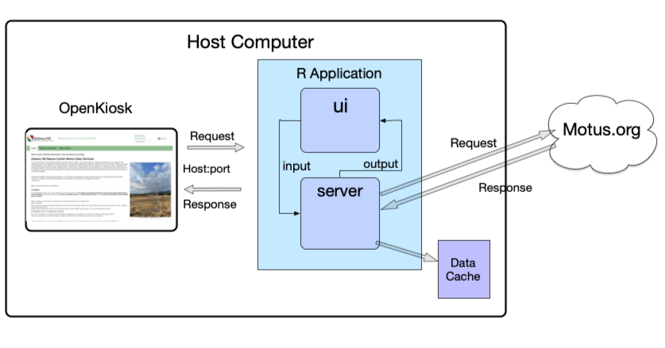

# 1  Start Here

### Build the Motus Kiosk web app

### Who do I talk to?

-   Owner/Originator: Richard Schramm - [schramm.r@gmail.com](mailto:schramm.r@gmail.com){.email}

- Please let me know if you experience problems or have questions. I am happy to try and help.
- *Also please let me know if you use the system!*  I would love to compile a list of locations where the app has been deployed!

**This** document is a guide on how to , the kiosk app out of source control (git), and how to do the first build.

In this document will guide you along the following path:

-   Present brief descriptions about the pieces that make up  the kiosk and how it works with motus.org
-   How get the  R and Studio  tools and packages  installed.
-   How to get the kiosk app out of source control (git).
-   Build and run the the default kiosk to make sure RStudio and everything setup and running correctly.
-   Clone the default kiosk into one that will become your own site-specific kiosk, ready to be customized.
-   Configure your copy of the kiosk.

At the end of these steps you should have your own copy of the shiny web app up-and-running using R-Studio on your local computer and ready to begin customizing it.

If you intend to deploy as a kiosk you will want to also complete steps in the document SETUP_FOR_WINDOWS.md in the project's top level directory.  Unfortunately there are quite a number of steps and tweaks to Windows 10 and the user accounts settings required to get the full, securely locked-down kiosk behavior we ultimately require. The provided document describes these settings and tweaks in full and painful detail.

The final deployment and configuration of the app to a kiosk-like display using OpenKiosk is described in the third companion document FINAL_DEPLOYMENT.md in the project's top level directory.

There is a document that describes  the available configuration parameters and performance 'tweeks' - CONFIGURATION_GUIDE_README.md

There is a useful document describing TIPS_TRICKS_AND_MAINTENANCE.md

If you are wanting to modify or further develop the application there is a fifth document named DEVELOPERS_README.md that may be helpful.

#### 1.0 - A Brief Description of "The System"

The 'kiosk system' can be viewed as built on these .

-   The operating system
-   The kiosk is a container (special kind of web browser) that 'hosts' the web application (OpenKiosk)
-   The programing language and development environment that the application runs in (R, and R-Studio)
-   The web application that runs inside the kiosk window to render the user interface and obtain the data from motus.org ('the code and supporting files')
-   The motus.org remote data server.



##### Operating System

Windows 10 Pro OS was specified a requirement for the Ankeny Hill Nature Center.

Nothing precludes you from choosing a different operation system. I have developed and run everything quite well at home under Mac OSX (v12.6) and then deployed to Windows 10 target. It should also be able to be run on small generic linux machines although I have not attempted to verify.

The kiosk mode of deployment is documented for Windows.  Deployment details for kiosk deployment to other platforms (OSX, linux) is a future (if ever) topic.

##### The programming/language environment

The Motus developers work in the R programing language. R-Studio provides a rich development environment and also integrates with the R package "Shiny" - which is what the actual web app (dashboard) has been developed in.

##### The OpenKiosk

The OpenKiosk is a basically a specialized web browser with configurable restrictions that will connect to our web application (via an http connect to a port on a web server).

See: <https://openkiosk.mozdevgroup.com>

There are many other ways to display the application including 1) running it in R and RStudio  2) standard Chrome or Firefox browsers or 3) 'pushing' the web app to remote web server for access by the www 

*It is important to recognize this distinction between the Shiny dashboard web application and the kiosk behavior being provided by OpenKiosk.*

##### Motus.org

The Motus Collaboration Policy (<https://motus.org/policy/>) specifies we should only provide data from the public "Basic open-access dataset". That dataset is the coarse "summary-level detection information".

All of the desired tagged bird detection information is available via simple http requests to the public motus.org servers.

##### The Application

The application is built in R-Studio using the R package "Shiny" (see: <https://shiny.rstudio.com/>) Shiny is an R package that makes it easy to build interactive web apps straight from R. You can host standalone apps on a webpage or build dashboards. When run on the local machine from a cmd line it will start a 'shiny server' on a local machine URL that you can point your browser to.


### 2.0 - Create two user accounts

Typically for a kiosk we would want to utilize two users accounts - one with administrator privileges and one non-administrator account.  

***While you may use any account name to get the project up-and-running - this and all other accompanying documentation assumes particular user accounts: "Admin" and "MOTUS_USER"***

If you initially want to just see if you can get something running quickly you certainly can just install and run everything on your local account (if you have admin permissons).  However to deploy either as a public kiosk or to a web server to you will certainly want to revisit these pages and 'harden' the system to be stable and secure.

( If you need help creating user accounts and setting permissions on Windows platforms please see: SETUP_FOR_WINDOWS.md

**2.1** - Create the Admin user account

**2.2** - Create the MOTUS_USER user account ** with no password** (see SETUP_FOR_WINDOWS.md section 14.0 - "Add MOTUS_USER user account with Auto-login")


### 3.0 - Installing R for your platform 

***In this documentation the administrator account is assumed to be "Admin"*** 

##### Windows:

Log in as administrator.   

If R is not already installed (see: <https://www.r-project.org/>) - Download the installer for your platform to your downloads folder

Double-click the installer.

Make sure it says to install into "C:\Program Files\R\R-4.4.2" (or whatever your current downloaded version is)

You also may need to install Rtools to be able to rebuild/install R packages . See: https://cran.r-project.org/bin/windows/Rtools/

**Other Operating systems:**

See:  https://cran.r-project.org/

For Apple OSX current version is  4.3.1 (2023-06-16)


### 4.0 - Install RStudio IDE Free Edition for your platform

RStudio is the development environment (IDE) that is used to create and test programs in R. 

##### 4.1 - Install RStudio 

Log in as administrator

Download RStudio for your platform from <https://www.rstudio.com/products/rstudio/download/>

Typically the installer will be in your "Downloads" folder.  Double-click it and follow the instruction, acccepting allof  the defaults.

##### 4.2 - Install Required R Packages

We use quite a few additional packages (software libraries) installed for R.  This can be a somewhat frustrating part depending on which revision levels of R and the various packages are currently considered 'current'. 

An annoying feature is that R by default installs packages in the current users local directories.  It seems desirable to install packages globally once for all users to avoid package version issues and confussion. However the instructions to do this  vary immensely depending on which operating system, which version, version, user permissions etc.

**So therefore I recommend installing packages twice! ** - once for user=Admin and then for user=MOTUS_USER.  Packages evolve very slowly rarely need updating until the version of R itself needs updating.  We can also use the RStudio IDE "Packages" management tab to track versions and keep each user updated when needed.

Advanced system users or administrators that may want to explore more global package installations and configuration. These links may help. 

https://cran.r-project.org/doc/manuals/R-admin.html#Managing-libraries

And: https://stackoverflow.com/questions/24387660/how-to-change-libpaths-permanently-in-r


**4.2.1** Run R console (as user = Admin).  (You can also enter these as commands in RStudio)  

**4.2.2** Now Log in user=MOTUS_USER, Run R console, and repeat the package installs.

**Note:** R may ask you to select a mirror site - Use one physically close to you. I used the mirror at OSU in Oregon)

Enter the following install.packages cmds into the R Console just to make sure all are installed for the both the Admin user and MOTUS_USER. I suggest doing them one linr at a time. 

    install.packages("shiny")
    install.packages("shinymeta")
    install.packages("shinyjs")
    install.packages("shiny.i18n")
    install.packages("shinyWidgets")
    install.packages("rvest")
    install.packages("tidyr")
    install.packages("lubridate")
    install.packages("sf")
    install.packages("tidyverse")
    install.packages("DT")
    install.packages("leaflet")
    install.packages("leaflet.extras2")
    install.packages("httr")
    install.packages("glue")
    install.packages("data.table")
    install.packages("anytime")
    install.packages("stringr")
    install.packages("xml2")
    install.packages("sf")
    install.packages("rjson")
    install.packages("fs")

**TROUBLESHOOTING Failed Package installs.**

**Note:** R may cleanly install or may report something like "The binary package is available but source versions are later".  

You can try installing with **install.packages("*thepkgname*", type="source")** to cause a recompile with rTools or  **install.packages("*thepkgname*", type="binary")**  Compiling from source would probably be best to get the latest fixes etc.

**Note:** Occasionally a package install may also hang with "package xxxx not found" displayed in the Console. So far that has been cleared by typing directly in the R-Studio Console like:

``` r
install.packages('xxxx', dependencies = TRUE)
or
install.packages('xxxx', dependencies = TRUE, repos='http://cran.rstudio.com/')
```


### 5.0 - Install  git

**git** is the repository checkout program that you will use to access the project on **github**. (github is the cloud repository that contains the code and documentation). Presumably if you are viewing this file you have at least visited the cloud repository. 

You will first (**as user=Admin**) need to install the program 'git' on the machine you wish to download the project to. (See: <https://git-scm.com/book/en/v2/Getting-Started-Installing-Git>)

NOTE: This install on windows machines can be a bit frustrating due to the variations of Windows 10 installations. WIndows 10 Pro was pretty straight forward. With Windows 10 Home Edition it is challenging to get git.exe recognized on the path. Persistence is key.. the git.exe install should be to C:\Program Files. You may need to 'cd' there in the cmd.exe window to run git...

### 6.0 - Create the user's "Projects" folder

.  *I will use a folder named "Projects"  for the throughout this documentation.*

**6.1** Whichever username you want the code to live under (eg. MOTUS_USER), navigate to that user's home directory and create a new folder to hold the project.  (Eventually the Projects folder may contain different versions of your kiosk project as your site evolves)

Log in as user = MOTUS_USER (or your intended username from above)

``` code
cd  C:\Users\MOTUS_USER
mkdir Projects
```

### 7.0 - Getting the code project from Github

Log in as user = MOTUS_USER (or your intended username from above)

This and all other accompanying documentation assumes a particular Windows10 user account (username=MOTUS_USER) and project directory structure: C:\Users\MOTUS_USER\_KIOSK\Projects

In your Projects folder..  (e.g.  **C:\Users\MOTUS_USER\Projects**)

*You dont need to register for a github account to clone a repository but it can be extremely helpful to do so if you want to check for updates,  submit bug reports, add your custom html pages into GitHub  etc. (see https://github.com/)*

Open a command window such as Cmd.exe (windows)  or iTerm (macs) and type:

``` code
cd  C:\Users\MOTUS_USER\Projects
git clone https://github.com/rschramm9/MOTUS_KIOSK.git
```

Git may pop-up an authentication options window in which case you will need to register. -- provide your git credentials via a web browser if asked. Once authenticated, the download should proceed along the lines of:

``` code
Cloning into 'MOTUS_KIOSK'...
remote: Enumerating objects: 11, done.
remote: Counting objects: 100% (11/11), done.
remote: Compressing objects: 100% (10/10), done.
remote: Total 11 (delta 4), reused 5 (delta 1), pack-reused 0
Receiving objects: 100% (11/11), 13.99 KiB | 2.33 MiB/s, done.
Resolving deltas: 100% (4/4), done.
```

A complete copy of the repository should now be in subdirectory at: C:\Users\MOTUS\_USER\Projects\MOTUS_KIOSK

### 8.0 - Your first test build

**8.1** Load project into RStudio.

- Run the RStudio IDE. Once open, Click File \> New Project
- From the "New Project" popup, select "Existing Directory"

- "Browse" **INTO** the folder: C:\Users\MOTUS\_USER\Projects\MOTUS_KIOSK and click "Open"

- After the  'FileOpen' dialog returns you to the wizard, Click "Create Project" button.

##### 8.2 Check the initial startup.cfg

Notice the row of tabs on the IDE right-side panel approximately mid page.  Select the 'Files' tab and navigate to the top-level project folder (MOTUS_KIOSK),  find startup.cfg and open it. It should look like below.

```
KiosksPath="~/Projects/MOTUS_KIOSK/kiosks"
StartKiosk="DEFAULT"
KioskCfgFile="kiosk.cfg"
```

The '~' instructs R to open the kiosk *relative* to the logged in users home directory.

##### 8.3 Check for packages 

- Notice the row of tabs on the IDE right-side panel approximately mid page.  Select the 'Files' tab and navigate and open the file  ***code/global.R***  ( "code" is a subdirectory of MOTUS_KIOSK top-level folder).

- Check at the top of the main source code window for a warning regarding several packages that may need still need to be installed... Go ahead and click the "Install" and Wait while it installs numerous package dependencies. This can take around 4 to 5 minutes....


​	Note: see hints back in section 4 regarding getting packages to install.

​	Repeat checking for other packages still needing to be installed (if any) for these source code files:

- open and check file: code/ui.R

- open and check file: server.R

  (And in the modules sub-folder....)

- open and check file: modules/receiverDeploymentDetections.R

- open and check file: modules/ReceiverDetections.R

- open and check file: modules/tagDeploymentDetails.R

- open and check file: modules/tagDeploymentDetections.R

##### 8.4 Ready to run.

Now close the tabs for all source code files **EXCEPT** global.R, ui.R and server.R

With one of those three files selected for view in the code window ( upper left quadrant), notice a green arrow labeled "Run App" should be visible in the upper quadrant 'file window' -click that.

After RStudio builds the app it should pop-up the app in its own browser window.

Watch for warnings or error in the console panel ( lower left quadrant) below the file window. 

Two other things to observe...

1-When the app is running - on the Console tab will be a red stop-sign. Use that to halt the app to make changes or reload the config file etc

2-Just after the app starts up, if you scroll down thru the output in the Console tab, you will find:

"Listening on [http://127.0.0.1:####](http://127.0.0.1:####){.uri}". This is the temporary URL server and port that Shiny assigns. You may be curious to try cutting that URL to your clipboard and pasting it into any browser on any machine on your local network. It should work!

### 9.0 - Make your own kiosk to customize

Next we will create a clone of the DEFAULT kiosk and give it your own name in your own folder.  This will become the kiosk you modify and run, customized with your own content and receivers etc.

Do you have a name in mind?  Whatever you like (*no spaces or special characters except underscore should be OK*).  I will use "mycustomkiosk"


**9.1** Decide where to keep your content. It can be anywhere however there are a couple obvious choices. The goal is to separate your customized site-dependent code from the repository code.

- Best practice is someplace outside of the repository project such as the user's "Documents" folder. eg  C:/Users/MOTUS_USER/Documents (or perhaps Projects). This keeps good separation and protection of your customized content from the files that came from the repository.

- In the MOTUS_KIOSK/kiosks folder (same as where DEFAULT lives) This is convient as you develop quickly using the IDE - however its messy to maintain once you 'go live' or need to update versions or bug fixesfrom the repository etc. 

  

**9.2** Open WindowsExplorer (or OSX Finder) and do a copy...

- Navigate to:  C:\Users\MOTUS\_USER\Projects\MOTUS_KIOSK

- "Copy" (right-click) the entire folder kiosks/DEFAULT 

- Navigate to your MOTUS_USER\Documents folder

- "Paste" the copy

- Navigate to that new kiosks folder (C:\Users\MOTUS_USER\Documents\kiosks)

- Right-click the "DEFAULT" folder and rename it "mycustomkiosk"

  If you have been following along with my conventions for names you should, you should now have a folder:  C:\Users\MOTUS_USER\Documents\kiosks\mycustomkiosk

### 10.0 - Configuration

##### 10.1 - Re-Point the starup.cfg to run your new kiosk.

Now back in the RStudio IDE -  select the 'Files' tab again and navigate to the top-level project folder and find startup.cfg.  Open it.

Change the StartKiosk value from DEFAULT to whatever path and name you used above. Again we can use relative paths here since we are working as a local user in the IDE.

```
KiosksPath="~/Documents/kiosks"
StartKiosk="mycustomkiosk"
KioskCfgFile="kiosk.cfg"
```

Save it and close the Startup.cfg file ( dont forget the 'Save' !)

Select the global.R file again and click 'Run app' button.  The app should run properly and if you scroll back in the console window and you should see a line like  "global KioskName:mycustomkiosk" 

From now on, you will be running and working to customize your own copy of the kiosk.

##### 10.2 - Edit your kiosk.cfg file.

In your own kiosk directory (mycustomkiosk)  is a file called kiosk.cfg.  It contains the default set of key/value pairs that do things like set the target motus receiver deployment(s), your icons , banner logos, main title etc.

Jump over to the document **2_CONFIGURATION_GUIDE_README.md** and set the parameters in your kiosk.cfg as described there. 

I suggest you initially change the top three items to see some immeadiate results... perhaps just the logo and the receivers?  (If your reciever hasnt had any detections you might want to stick to the defaults for awhile)  (Copy your organizations logo to the www/images/logos folder)

Then restart the web application in Studio to verify the results.

##### Good break point - You can easily delay the next two steps and jump to configuring windows to autostart and run the application as a locked-down kiosk (FINAL_DEPLOYMENT_FOR_WINDOWS guide).  Well done!


### 11.0 - Configure your own "Home" tab content

The descriptive content that appears in the in the main page body when ever the "Home" tab is open comes from a language dependent .html file found in the project sub-directory at **www/homepages**

I suggest you at minimum modify the page title from "Default Homepage for a Generic Motus Data Kiosk" to something more relevant to you so you have a good visual cue your looking at the correct homepage.

There should be one file for each language that the application supports - currently: English, Spanish and French.  Feel free to copy and edit the default pages provided.  And make sure to set the correct filenames in your kiosk.cfg configuration file

-   default_homepage_en.html for English

-   default_homepage_es.html for Spanish

-   default_homepage_fr.html for French

Edit these files carefully with an html editor or a text editor of your choice.

*Someplace visible in your kiosk you **must** give proper credit to the Motus folks and Birds Canada and should include a statement regarding Acceptable Use.* I have chosen to put that in the section "Credits" on the "Home" screen.

**WARNING:** Teaching html document structure is beyond the scope of this documentation. Be careful to maintain correct opening and closing html tags and verify that your changes render correctly in an html browser such as firefox or chrome before replacing the existing files.

### 12.0 - Configure your own "Species" tab content

*It is up to you if you want to work on creating your own species page content at this point. You can easily delay this task and jump to configuring windows to autostart and run the application as a locked-down kiosk.*

The descriptive content that appears in the in the in the "Species" tab when ever a new animal is selected comes from a language dependent .html file in the project sub-directory www/speciespages.

There should be a files for each species you want to describe, one in each language you wish to support.

***File name choice here is critical.*** The software builds a compacted lowercase 'key' using the motus species name field and tries to match that to a file in the speciespages directory.

To add your own species files, copy any group files (one for each language) to use as templates and edit them carefully with an html editor or a text editor for the species of your choice. Save them using the filename pattern described above.

**WARNING:** Teaching html document structure is beyond the scope of this documentation. Be careful to maintain correct opening and closing html tags and verify that your changes render correctly in an html browser such as firefox or chrome before replacing the existing files.
