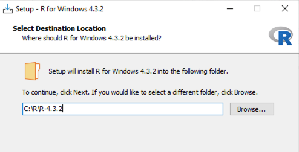
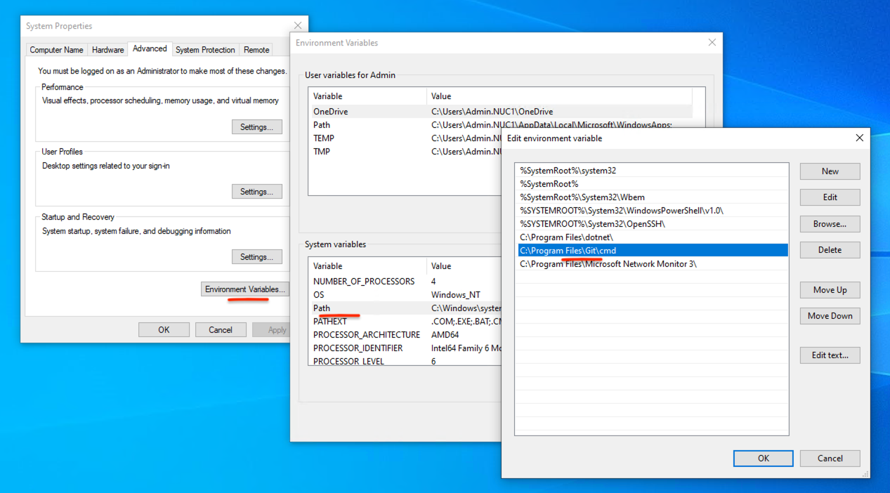
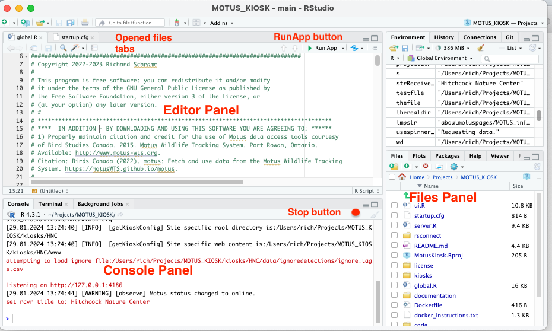
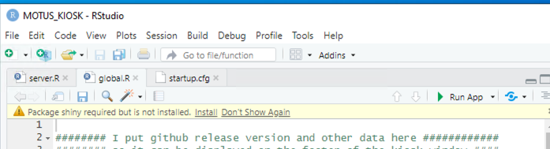
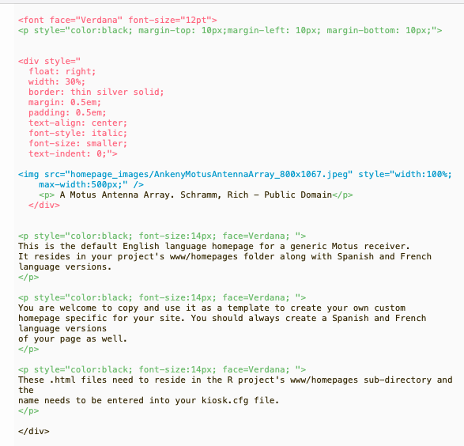
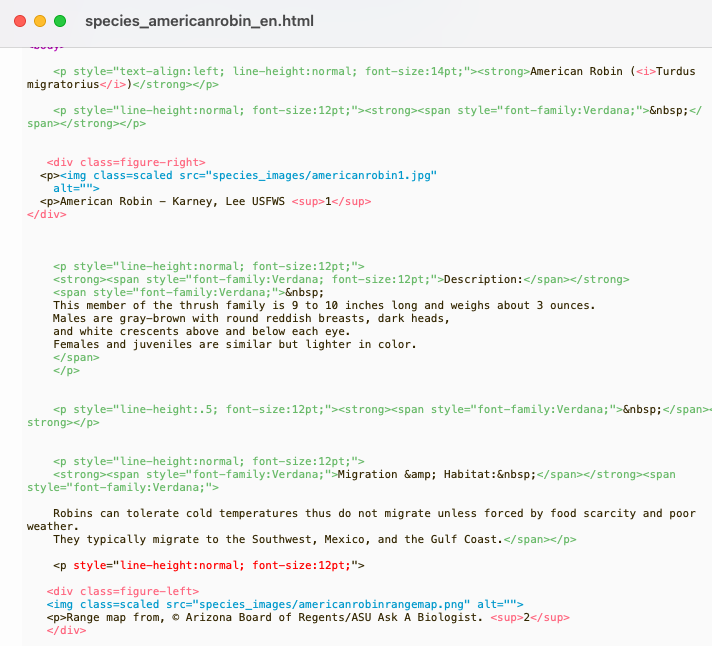

# 1  Start Here

### Build the Motus Kiosk web app

### Who do I talk to?

-   Owner/Originator: Richard Schramm - [schramm.r@gmail.com](mailto:schramm.r@gmail.com){.email}

- Please let me know if you experience problems or have questions. I am happy to try and help.
- *Also please let me know if you use the system!*  I would love to compile a list of locations where the app has been deployed!

**This** document is a guide on how to , the kiosk app out of source control (git), and how to do the first build.

In this document will guide you along the following path:

-   Present brief descriptions about the pieces that make up  the kiosk and how it works with motus.org
-   How get the  R and Studio  tools and packages  installed.
-   How to get the kiosk app out of source control (git).
-   Build and run the the default kiosk to make sure RStudio and everything setup and running correctly.
-   Clone the default kiosk into one that will become your own site-specific kiosk, ready to be customized.
-   Configure your copy of the kiosk.

At the end of these steps you should have your own copy of the shiny web app up-and-running using R-Studio on your local computer and ready to begin customizing it.

After cusomization, if you intend to deploy as a kiosk you will want to also complete steps in the next two  documents.  SETUP_FOR_WINDOWS.md in the project's documents directory.  This document covers steps and tweaks to Windows 10 and the user account settings required to get the full, securely locked-down kiosk behavior we require. 

The final deployment and configuration of the app to a kiosk-like display using OpenKiosk is described in the companion document FINAL_DEPLOYMENT_FOR_WINDOWS.md in the project's documents directory.

There is a document that describes  all of the available configuration parameters  - the CONFIGURATION_GUIDE_README.md

There is also useful document describing TIPS_TRICKS_AND_MAINTENANCE.md

If you are wanting to modify or further develop the application there is also document named DEVELOPERS_README.md that may be helpful.

#### 1.0 - A Brief Description of "The System"

The 'kiosk system' can be viewed as built on these .

-   The operating system
-   The kiosk is a container (special kind of web browser) that 'hosts' the web application (OpenKiosk)
-   The programing language and development environment that the application runs in (R, and R-Studio)
-   The web application that runs inside the kiosk window to render the user interface and obtain the data from motus.org ('the code and supporting files')
-   The motus.org remote data server.


##### Operating System

Windows 10 Pro OS was specified a requirement for the Ankeny Hill Nature Center.

Nothing precludes you from choosing a different operating system. I have developed and run everything quite well at home under Mac OSX (v12.6) and then deployed to Windows 10 target. It should also be able to be run on small generic linux machines although I have not attempted to verify.

The kiosk mode of deployment is documented for Windows.  Deployment details for kiosk deployment to other platforms (OSX, linux) is a future (if ever) topic.

##### The programming/language environment

The Motus developers work in the R programing language. R-Studio provides a rich development environment and also integrates with the R package "Shiny" - which is what the actual web app (dashboard) has been developed in.

##### The OpenKiosk

The OpenKiosk is a basically a specialized web browser with configurable restrictions that will connect to our web application (via an http connect to a port on a web server).

See: <https://openkiosk.mozdevgroup.com>

There are many other ways to display the application including 1) running it in R and RStudio  2) standard Chrome or Firefox browsers or 3) 'pushing' the web app to remote web server for access by the www 

*It is important to recognize this distinction between the Shiny dashboard web application and the kiosk behavior being provided by OpenKiosk.*

##### Motus.org

The Motus Collaboration Policy (<https://motus.org/policy/>) specifies we should only provide data from the public "Basic open-access dataset". That dataset is the coarse "summary-level detection information".

All of the desired tagged bird detection information is available via simple http requests to the public motus.org servers.

##### The Application

The application is built in R-Studio using the R package "Shiny" (see: <https://shiny.rstudio.com/>) Shiny is an R package that makes it easy to build interactive web apps straight from R. You can host standalone apps on a webpage or build dashboards. When run on the local machine from a cmd line it will start a 'shiny server' on a local machine URL that you can point your browser to.


### 2.0 - Create two user accounts

Typically for a kiosk we would want to utilize two users accounts - one with administrator privileges and one non-administrator account.  

***While you may use any account name to get the project up-and-running - this and all other accompanying documentation assumes particular user accounts: "Admin" and "MOTUS_USER"***

If you initially want to just see if you can get something running quickly you certainly can just install and run everything on your local account (if you have admin permissons).  However to deploy either as a public kiosk or to a web server to you will certainly want to revisit these pages and 'harden' the system to be stable and secure.

If you need help creating user accounts and setting permissions on Windows platforms please see: SETUP_FOR_WINDOWS.md

**2.1** - Create the Admin user account

**2.2** - Create the MOTUS_USER user account ** with no password** (see SETUP_FOR_WINDOWS.md section 14.0 - "Add MOTUS_USER user account with Auto-login")


### 3.0 - Create the user's "Projects" folder

.  *I will use a folder named "Projects"  for the throughout this documentation.*

**3.1** Whichever username you want the code to live under (eg. MOTUS_USER), navigate to that user's home directory and create a new folder to hold the project.  (Eventually the Projects folder may contain different versions of your kiosk project as your site evolves)

Log in as user = MOTUS_USER (or your intended username from above)

``` code
cd  C:\Users\MOTUS_USER
mkdir Projects
```


### 4.0 - Installing R and packages for your platform 

```
**** IMPORTANT NOTE ****:   it is important to understand where R software 'packages' will
 be installed. Packages can be installed 'globally'- once for all 'users', or individually -
once for each user account.  If R is already installed on your computer it is likely it
defaulted to requireing packages be installed per-user. I describe how to install packages
globally below. Just be aware you may need to install packages multiple times.
RStudio will help alert you to any missing packages.
```

**4.1**  Download R

If R is not already installed (see: <https://www.r-project.org/>) - Download the installer for your platform to your downloads folder

**4.2** Log in as an administrator - User=Admin

- Double-click the installer from your Downloads folder.

- The installer asks where to install. **We do not want the default "C:\ProgramFiles"**  Modify it to install into "C:\R\R-4.3.2" (or whatever your current R downloaded version is). 

- 


  (Avoiding installation to C:\ProgramFiles is what allows us to install packages globally)

- Accept all of the other installer defaults.

**4.3**  Run the R.exe console program as user = Admin to install packages  

**Note:** R may ask you to select a mirror site - Use one physically close to you. I used the mirror at OSU in Oregon)

Enter the following install.packages cmds into the R Console. I suggest doing them a few at a time to watch for any failures.  It can take serveral minutes to completely install some of the larger packages.

    install.packages("shiny")
    install.packages("shinymeta")
    install.packages("shinyjs")
    install.packages("shiny.i18n")
    install.packages("shinyWidgets")
    install.packages("shinybusy")
    install.packages("rvest")
    install.packages("tidyr")
    install.packages("lubridate")
    install.packages("sf")
    install.packages("tidyverse")
    install.packages("DT")
    install.packages("leaflet")
    install.packages("leaflet.extras2")
    install.packages("httr")
    install.packages("glue")
    install.packages("data.table")
    install.packages("anytime")
    install.packages("stringr")
    install.packages("xml2")
    install.packages("sf")
    install.packages("rjson")
    install.packages("fs")
    install.packages("units")

**4.4**  If you are not installing packages "globally" for all users as described above in 4.0 - repeat package installations using R console while logged in as user=MOTUS_USER.


**4.5  TROUBLESHOOTING Failed Package installs.**

**Note:** R may cleanly install or may report something like "The binary package is available but source versions are later".  

You can try installing with **install.packages("*thepkgname*", type="source")** to cause a recompile with RTools or  **install.packages("*thepkgname*", type="binary")**  Compiling from source would probably be best to get the latest fixes etc.

RTools is a separate program that must be installed. See https://cran.r-project.org/bin/windows/Rtools/

**Note:** Occasionally a package install may also hang with "package xxxx not found" displayed in the Console. So far that has been cleared by typing directly in the R-Studio Console like:

``` r
install.packages('xxxx', dependencies = TRUE)
or
install.packages('xxxx', dependencies = TRUE, repos='http://cran.rstudio.com/')
```


### 5.0 - Install RStudio IDE Free Edition for your platform

RStudio is the 'integrated development environment' (IDE) that is used to create and test programs in R. 

##### 5.1 - Install RStudio 

Log in as an **administrator.**

Download RStudio for your platform from <https://www.rstudio.com/products/rstudio/download/>

Typically the installer will be in your "Downloads" folder.  Double-click it to run and follow the instructions, acccepting all of the defaults (This app is ok to install to Program Files)


### 6.0 - Install  git

**git** is the repository checkout program that you will use to access the project on **github**. (github is the cloud repository that contains the code and documentation). Presumably if you are viewing this file you have at least visited the cloud repository. 

You will first (**as user=Admin**) need to install the program 'git' on the machine you wish to download the project to. (See: <https://git-scm.com/book/en/v2/Getting-Started-Installing-Git>)

NOTE: This install on windows machines can be a bit frustrating due to the variations of Windows 10 installations. WIndows 10 Pro was pretty straight forward. With Windows 10 Home Edition it is challenging to get git.exe recognized on the path. Persistence is key.. the git.exe install should be to C:\Program Files. You may need to 'cd' there in the cmd.exe window to run git...

Most issues involve git not being able to add itself to your "Path" environment variable.  To check/resolve

On windows, in the "Search Box" type "env" and it should show something like: "Edit System Environment Variables".  

Run that application and provide the Admin password when asked.

In the "System Properties" popup, select "Environment Variables", 

In the next Popup, select "Path" in the "System Variables" click "Edit"

Add a line that says "C:\Program Files\Git\cmd" 




### 7.0 - Getting the code project from Github

Log in as user = MOTUS_USER (or your intended username from above)

This and all other accompanying documentation assumes a particular Windows10 user account (username=MOTUS_USER) and project directory structure: C:\Users\MOTUS_USER\_KIOSK\Projects

In your Projects folder..  (e.g.  **C:\Users\MOTUS_USER\Projects**)

*You dont need to register for a github account to clone a repository but it can be extremely helpful to do so if you want to check for updates,  submit bug reports, add your custom html pages into GitHub  etc. (see https://github.com/)*

Open a command window such as Cmd.exe (windows)  or iTerm (macs) and type:

``` code
cd  C:\Users\MOTUS_USER\Projects      (or  cd ~/Projects for Macs)
git clone https://github.com/rschramm9/MOTUS_KIOSK.git
```

Git may pop-up an authentication options window in which case you will need to register an account with GitHub . -- provide your git credentials via a web browser if asked. Once authenticated, the download should proceed along the lines of:

``` code
Cloning into 'MOTUS_KIOSK'...
remote: Enumerating objects: 11, done.
remote: Counting objects: 100% (11/11), done.
remote: Compressing objects: 100% (10/10), done.
remote: Total 11 (delta 4), reused 5 (delta 1), pack-reused 0
Receiving objects: 100% (11/11), 13.99 KiB | 2.33 MiB/s, done.
Resolving deltas: 100% (4/4), done.
```

A complete copy of the repository should now be in subdirectory at: C:\Users\MOTUS\_USER\Projects\MOTUS_KIOSK

### 8.0 - Your first test build

**8.1** Load project into RStudio.

- Run the RStudio IDE.  Once open, Click File \> New Project
- From the "New Project" popup, select "Existing Directory"

- "Browse" **INTO** the folder: C:\Users\MOTUS\_USER\Projects\MOTUS_KIOSK and click "Open"

- After the  'FileOpen' dialog returns you to the wizard, Click "Create Project" button.

- Familiarize yourself with this diagram as you proceed to run the application in RStudio




##### 8.2 Check the initial startup.cfg

Notice the row of tabs on the IDE right-side panel approximately mid page.  Select the 'Files' tab and navigate to the top-level project folder (MOTUS_KIOSK),  find startup.cfg and open it. It should look like below in the Editor Panel.

```
KiosksPath="~/Projects/MOTUS_KIOSK/kiosks"
StartKiosk="DEFAULT"
KioskCfgFile="kiosk.cfg"
```

The '~' instructs R to open the kiosk *relative* to the logged in users home directory.

##### 8.3 Check for missing packages (Again!) 

- Notice the row of tabs on the RStudio IDE right-side panel approximately mid page.  Select the 'Files' tab and navigate and open the file  ***global.R***  and open it.

- Check at the top of the code Editor Panel for any warnings regarding several packages that may need still need to be installed... 




- Go ahead and click the "Install" and wait while it installs any more package dependencies. (This can take around 4 to 5 minutes....)


​	Note: see hints back in section 4.5 regarding getting packages to install.

​	Repeat checking for other packages still needing to be installed (if any) for these source code files:

- open and check file: ui.R

- open and check file: server.R

  (And now in the in the code/modules sub-folder....)

- open and check file: code/modules/receiverDeploymentDetections.R

- open and check file: code/modules/ReceiverDetections.R

- open and check file: code/modules/tagDeploymentDetails.R

- open and check file: code/modules/tagDeploymentDetections.R

##### 8.4 Ready to run !

Now close the tabs for all source code files **EXCEPT** global.R, ui.R and server.R

With one of those three files selected for view in the code window ( upper left quadrant), notice a green arrow labeled "Run App" should be visible in the upper quadrant 'file window' -click that.

After RStudio builds the app it should pop-up the app in its own browser window.

Watch for warnings or error in the Console Panel ( lower left quadrant). 

**Two other things to observe...**

1-When the app is running - on the Console tab will be a red stop-sign. Use that to halt the app to make changes or reload the config file etc

2-Just after the app starts up, if you scroll down thru the output in the Console tab, you will find:

"Listening on [http://127.0.0.1:####](http://127.0.0.1:####){.uri}". This is the temporary URL server and port that Shiny assigns. You may be curious to try cutting that URL to your clipboard and pasting it into any browser on any machine on your local network. It should work!

### 9.0 - Make your own kiosk to customize

Next we will create a clone of the DEFAULT kiosk and give it your own name in your own folder.  

***This will be the kiosk you modify and run, customized with your own content and receivers etc.***

Do you have a name in mind?  Use whatever you like (*except no spaces or special characters -  underscore should be OK*).  I strongly suggest you keep it short.  Long names may cause you headaches later on.  I will use the name "customkiosk" here for documentation purposes.

**9.1** Decide where to keep your content. It can be anywhere however there are a couple obvious choices. The goal is to separate your customized site-dependent code from the repository code.

1. Best practice is someplace outside of the repository project such as the user's "Documents" folder. eg  C:/Users/MOTUS_USER/Documents. 

   - This keeps good separation and protection of your customized content from the files that came from the repository. 
   - It has advantages if you want to use a code repository like github to maintain your content. 

2. Or you may prefer to add it to the MOTUS_KIOSK/kiosks folder (along side where DEFAULT lives).

   - This is convient as you develop quickly using the IDE.
   - It is somewhat messy to maintain if you intend to add your content to your own it to a github repository.

   *I will assume in this documentation that you will use location 1* (C:/Users/MOTUS_USER/Documents)

**9.2** Open WindowsExplorer (or OSX Finder) and do a copy...

- Navigate to:  C:\Users\MOTUS\_USER\Projects\MOTUS_KIOSK

- "Copy" (right-click) the entire subfolder folder "kiosks" 

- Navigate to your MOTUS_USER\Documents\ folder

- "Paste" the copy

- Navigate into that new kiosks folder (C:\Users\MOTUS_USER\Documents\kiosks)

- Right-click the "DEFAULT" folder and rename it "customkiosk"

  If you have been following along with my conventions for names you should, you should now have a folder:  C:\Users\MOTUS_USER\Documents\kiosks\customkiosk
  
  

### 10.0 - Configuration

##### 10.1 - Re-Point the starup.cfg to run your new kiosk.

Now back in the RStudio IDE -  select the 'Files' tab again and navigate to the top-level project folder and find startup.cfg.  Open it in the editor.

- Change the KiosksPath to whatever folder path you used above. 
- Change the StartKiosk value from DEFAULT to whatever name you used above. Again we can use relative paths here since we are working as a local user in the IDE.

```
KiosksPath="~/Documents/kiosks"
StartKiosk="customkiosk"
KioskCfgFile="kiosk.cfg"
```

- Save it and close the Startup.cfg file ( dont forget the 'Save' !)

- Select the global.R file again and click 'Run app' button.  The app should run properly and if you scroll back in the console window and you should see a line like  "global KioskName:customkiosk" 


From now on, you will be running and working to customize your own copy of the kiosk.

##### 10.2 - Edit your kiosk.cfg file.

In your own kiosk directory (customkiosk)  is a file called kiosk.cfg.  It contains the default set of key/value pairs that do things like set the target motus receiver deployment(s), your icons , banner logos, main title etc.

Jump over to the document **2_CONFIGURATION_GUIDE_README.md** and set the parameters in your kiosk.cfg as described there. 

I suggest you initially change the top three items to see some immeadiate results... perhaps just the logo and the receivers?  (If your reciever hasnt had any detections you might want to stick to the defaults for awhile)  (Copy your organizations logo to the www/images/logos folder)

Then restart the web application in Studio to verify the results.

##### Good break point - You can easily delay the next two steps and jump to configuring windows to autostart and run the application as a locked-down kiosk (FINAL_DEPLOYMENT_FOR_WINDOWS guide).  Well done!


### 11.0 - Configure your own "Home" tab content

The descriptive content that appears in the in the main page body when ever the "Home" tab is open comes from a language dependent .html file.

**WARNING:** Teaching html document structure is beyond the scope of this documentation. Be careful to maintain correct opening and closing html tags as described below and verify that your changes render correctly in an html browser such as firefox or chrome before replacing the existing files.

**Homepage HTML files are found in your kiosk's  www/homespages subdirectory.** If you followed along section 9.0,  that would be your Documents folder at kiosks/customkiosk/www/homepages

I suggest you at minimum modify the page title from "Default Homepage for a Generic Motus Data Kiosk" to something more relevant to you so you have a good visual cue your looking at the correct homepage.

There will be one file for each language that the application supports - currently: English, Spanish and French. 

- Begin by **copying** the default english file from *default_homepage_en.html* to *customkiosk_homepage_en.html* (or name of your choice)
- Place any images you intend to use into the www/homepages/homepage_images folder.
- Open the new html file with either an html editor or a plain text text editor.  Any standard text editor (eg Notepad) can be used as the text within these pages is relatively simple to identify.  (An html editor can be useful if you are new to editing html).  Or an editor with color "syntax highlighting" can help identify the content needing modification  (see Figure 1.)

 

- Carefully work through the document replace any content within standard html 'tags'. (eg <div> </div>div or <p></p> tags.

- Link to your own images in the homepages/homepage_images directory by modifying the image links  in the html file to point to the correct images.

- *Someplace visible in your kiosk you **must** give proper credit to the Motus folks and Birds Canada and should include a statement regarding Acceptable Use.* I have chosen to put that in the section "Credits" on the "Home" screen.

- Save your edited file.

- You can easily check your work as you go by opening the file in any web browser. 

- Once you are satified with your new page (using a browser to check)  you need to make files for the other languages your support (ge. _es.html, _es,html files) as described in **Appendix 1**  of this document.

- Test all newly translated files by opening in a web browser.

- Finally - **make sure to set the correct filenames in your kiosk.cfg configuration file.**   Then retest using the kiosk application.

  

### 12.0 - Configure your own "Species" tab content

*It is up to you if you want to work on creating your own species page content at this point. You can easily delay this task and jump to configuring windows to autostart and run the application as a locked-down kiosk.*

The descriptive content that appears in the in the in the "Species" tab when ever a new animal is selected comes from a language dependent .html file in the project sub-directory www/speciespages.

**WARNING:**  *when creating species content, it is your responsibility to be sure you have legal permission to use all images, maps and text you incorporate. Be sure to give proper credit for anything you use. Most content taken from the web is protected by copyright or other terms of use.  Many favorite birding sites such as Audubon, EBird and Cornell have prohibitions against repurposing (or reposting) their images and content.  If you cant find and document a clear statement that you have the permission to use - don't use it.*

There should be several files for each species you want to describe - one in each language you wish to support.  
Notice that the filenames must all begin with "species_"  and end with the same pattern for the supported languages (eg.  _en.html, _fr.html, _es.html )

The file name choice here is critical. The software builds a compacted lowercase filename using the motus plain english species name field.
 All special characters (~!@#$%^&*(){}+:"<>?,./;'[]-=) and any white space are removed.  The program builds the filename string by adding the leading "species"  and the trailing "_en.html" and then tries to match that to a file in the speciespages directory.  

So motus detections of an  "American Robin" will match to a file  named "species_americanrobin_en.html" for English and "species_americanrobin_en.html" in Spanish etc.

Similarly a motus species name of "Swainson's Trush" compacted and formatted become filename of "species_swainsonsthrush_en.html"   (or _es.html and _fr.html for other languages)

A motus species name of "Eastern Whip-poor-will" compacted and formatted become filename of "species_easternwhippoorwiil_en.html" (or _es.html and _fr.html for other languages)

**Species HTML files are found in your kiosk's  www/speciespages.**

To add your own species files:

- Copy ***one*** of the existing species pages to be used as a template for the new species. For example to make a new page for a Swainson's Thrush, copy *species_americanrobin_en.html* to *species_swainsonsthrush_en.html* (if you prefer to work in French or Spanish, use the _fr or _es file)
- Place any images you intend to use into the www/speciespages/species_images folder
- Open the html file with either an html editor or a plain text text editor.  () An html editor can be useful if you are new to editing html).   Or any standard text editor (eg Notepad) can be used as the text within these pages is relatively simple to identify. However an editor with color "syntax highlighting" can help identify the content needing modification (see Figure 2.) 
  
- Carefully work through the document replace any content within standard html 'tags'. (eg <div> </div>div or <p></p> tags.
- Link to your own images in the speciespages/species_images directory by modifying the image links  in the html file to point to the correct images.
- Save your edited file following the filename pattern described above.
- You can easily check your work as you go by opening the file in any web browser. 
- Once you are satified with your new page (using a browser to check)  you need to make files for the other languages your support (ge. _es.html, _es,html files) as described in **Appendix 1**  of this document.

-  Finally test all new files by opening in a web browser, then retest using the kiosk application.


​    

### Appendix 1 - Translating HTML

After you are satified with your new page in your chosen language (using a browser to check)  you need to make files for any other languages you support (e.g.   _es.html,  _es.html )

- Copy the html file you wish to translate to make one each for the other languages  The files will still be in english at this point - but with a new filenames indicating the language you will translate to: some_page_en.html is copied to both some_page_fr.html and some_page_es.html

- If you have an "html page translation application" you can use it to translate each file. 

- Otherwise, you will need to manually translate each file using a free tool such as Goodle Translate

   (http://translate.google.com)

  - Open the just-coped file(s) in an html or plain text editor.

  - Work your way through the file tag by tag or in small sections by selecting and copying the translatable text content and pasting into Google Translate.  

  - Set the target translation language and then then select the translated content and copy (select,copy and paste ) it back into the html file in place of the original English content.

  - When finished with the entire document - save the translated html and then test by opening it in any browser.

  - Repeat for any additional files in other languages.

