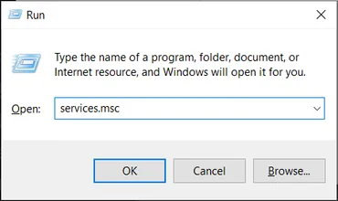
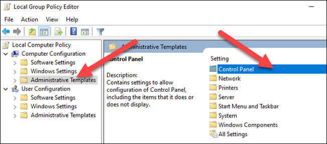
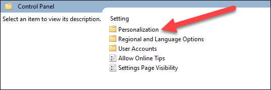

# Setup for Windows 11 Pro OS


###  MOTUS Kiosk Setup for Windows 11 Pro OS ###
This document is a guide on how to get the Windows 11 Pro computer set-up to host the the 'Motus Kiosk'   It is one of the four documents that I use to describe the full setup of the kiosk.

***If you are working on a Windows 10 Pro - please jump over to the SETUP_FOR_WINDOWS_10.md document***

We begin by describing how to setup a brand new machine with MS Windows11 Pro preinstalled. Then go on to detail the required changes to 'out-of-the-box' windows that are needed to make the kiosk app behave the way we would expect.

This doc also includes some steps that 'technically unnecessary' but deal with my personal pet peaves regarding clutter and bloat that make me dislike MS Windows.  I will try and alert you to those as "Optional"

 Sections 1, 2 and 3  describe bringing up a brand new Windows 11 machine from scratch, setting its name and getting it on the network (wifi).   It assumes you just received a new computer with a freshly installed Windows 11 operating system with an administrator acount you can log into.  If you are jumping in from a computer that has already been 'spun up' with you as an administrator login you can skip to Section 4.

It is intended to coach a user inexperienced in computer admin through the arduous windows system admin setup process in excruciating detail.  If you are reasonable well experienced in Windows system administration it will be more tedious and verbose than you need - sorry.  

If you are a novice, hopefully it will be detailed enough to get you through and on to the fun parts. It may seem daunting but if you proceed steadily and carefully (and *ask for help* if something doesnt go right). You will get there.

Also - if you are jumping in from a computer that has already been 'spun up' or if you like to skip ahead but be advised, you may get away with skipping some steps but you will likely need to come back here to get everything set just as it should be. **Particularly important is to get the MOTUS_USER account set to auto login, (we do this in Section 15 of this document)**


### Who do I talk to? ###

* Owner/Originator:  Richard Schramm - schramm.r@gmail.com

### Preliminaries ###

Unfortunately Microsoft supplies 'Windows 11' in different configurations - Windows 11Pro is recommended though you may have received 'Home Edition'. Or you may have ended up with a Windows-10 variant

There are so many variations within released Windows versions and even customizations - so called 'Experience packages' within versions.  So it is impossible to write detailed instructions that are accurate across all variations.

Strongly advised is Windows 11-Pro and that is what this document assumes.  Hopefully where we differ you can use what I provide and some hunting-around to get to the correct settings.

We will be setting up two accounts, one user with administrator permissions and one unprivileged user that the kiosk will run under.  The unprivileged account will be auto-login *with no password*. 

You should be prepared to provide the following information:

* a good username and password for the administrator account.  I will use username = Admin
* a good name for the kiosk unprivileged user account I will use is MOTUS_USER.  If you choose to use a different username and just pay close attention to where this and the companion documentation differs.

#### Main 1.0 - New Computer w/Windows 11 - First Boot

***You may skip to Section Main 2.0 if you already have a computer you can log in as the administrator.***

If you aquired this computer as new - the first boot will take you through creating the first administrator account. If you received a preowned computer it will likely already have an administrator account and boot directly in to it. Typically the account is named something like "User" or your name.  It like required you to provide a login PIN instead of a password.  (In later steps here  we will revert to using a password instead of PIN to login) 

Here we assume a brand new computer with Windows pre-installed.

Below is the approximate sequence I saw and followed on first boot of my Intel NUC computer with MS Windows 11

1. Power on, let the boot start…  *I didn't do F10 key or anything at the bios ‘select boot’ screen*
2. After about 2 minutes while it was looking dead,  it should finally start to boot, it may say restarting etc, then it eventually goes back to ‘select boot’, bios screen and then proceeds to start the boot to windows. Be patient...
3. It may go straight into ‘working on updates’ blue screen.  It takes awhile,  Says “94% complete” fairly quickly, then still took a while to get to 100%. ( I don’t know where it thinks its getting updates from…. its likely not on the network yet, - just let it go)
4. Eventually you will get some kind of  “User ‘Welcome" message
5. You may get a whole series of questions from the 'Cortana' assistant - if you do:
   1. If you get asked to create a user - create a user named "Admin" and provide some security answers if you are forced to (I dont like these and will disable them further down in this guide.
   2. When Cortana gets to "Choose privacy settings" turn the all 'Off'
   3. When Cortana asks "Let Cortana help you" Choose "Not Now"

6. Eventually get auto-logged in - it may ask you to browse with 'Microsoft Edge' - choose "Maybe Later"
7. Click the lower-left corner ‘Start Window’ icon:  
    Hover over the logged-in person icon - it should show the user you are logged in as -  right-click it and then pick ‘Change account settings’
8.   *Verify below your username it says you are a Local Account and below that is says Administrator*

#### Main 2.0 - Connection to Wireless Network

I am using wifi to connect to the internet. *If you already auto connect to network on your computer you may skip this step.*

1. In the search box , lower-right corner type Settings.  Select the 'Settings App'  and open it.
2. Choose to 'Network&Internet'  
3. Click in the the WiFi section, Turn the WiFi switch to  ON
4. Click "Show available networks"
5. A Pop-up shows all available network names, choose your WiFi system 
6. Check "Connect Automatically" (if shown) and click  "Connect" 
7. Log into your network (and set ‘login to this network automatically’ if it is shown here)

#### Main 3.0 - Rename computer (optional)

1. In the search box , lower-right corner type Settings.  Select the 'Settings App'  and open it.

2. Click on System (left sidepanel)

3. Below the System should be the current computer name.

4. Use 'Rename' link just below it to change the name to anything you like.  I used AHNC-MOTUS1

   

#### Main 4.0 - Change from using PIN to login to using passwords

1. In the search box , lower-right corner type regedit and click the app to open it

2. In the leftside panel - navigate to: HKEY_LOCAL_MACHINE\SOFTWARE\Microsoft\PolicyManager\default\Settings\AllowSigninOptions and select it.

3. On the rightside panel, right-click on "value' and select "Modify"

4. In the Value data box, enter 0

5. Click OK and exit the Registry Editor.

   

#### Main 5.0 - Change group password policy to disable the “password security questions” 

I dont like to expose this password discovery mechanism on a computer that may have shared users. (Personal info may be discoverable). ***Disabling the feature  is optional**.*  While logged in as an administrator - We will edit an existing group policy using "gpedit" 

1. Open the Start menu in desktop lower-left and Search for gpedit and run it (note it may say "Edit Group Policy" instead of gpedit). 

2. Browse the following path: Computer Configuration > Administrative Templates > Windows Components > Credential User Interface.

3. On the right side, double-click the "Prevent the use of security questions for local accounts" policy.

4. Select the “Enabled” radio button. (you are ‘enabling’ the prevention policy)

5. Select 'Apply' then ‘OK’

6. Close the Group Policy Editor

   


#### Main 6.0 - Remove “Microsoft OneDrive”  (Optional)

ControlPanel>Programs&Features  Select One-Drive , Rightclick and choose UnistallProgram


#### Main 7.0 - Customize Microsoft Edge (Optional)

The first time you run Microsoft's default Edge browser it may go through several windows that attempt to sign you up for a bunch of services and features we do not need or want.  Go ahead and open Edge and be careful on those first few screens.  It is completely ok to select No Thanks to everything and to 'Proceed without this data' etc.

#### Main 8.0 - Install Google Chrome

Before starting please read and note the following

- ***if asked - do not ‘sign-in’ to google, setup any apps (mail etc)***

- ***if asked - do not turn on ‘Sync’, do not ’Import Settings’ or ‘Bookmarks’***

- ***if asked deselect any add-ins, tracking and bloat-ware that google offers**.*

- Use the Microsoft's "Edge" browser to find, download and install Chrome (run the downloaded setup.exe).

- Exit Edge when done 

- Open Chrome by double-clicking the desktop icon, ***then follow directions to set it as the default browser***.

  


#### Main 9.0 - Install Firefox Browser

Use Chrome search for and download Firefox installer

Note Firefox download  may put the installer in your 'Downloads' folder , use the explorer to run it from there 

Running firefox for the first time  ***no sign-in, no extra features etc.***


#### Main 10.0 - Turn off auto-updates

Window auto-updates often break things or require human intervention etc. which interferes with the kiosk miodel of unattended operations. So I like to control when updates happen manually - so I can backup and roll-back if something breaks or needs a reboot etc.

 Follow instructions in Appendix 2

#### Main 11.0 - Disable the windows “Lock Screen” 

(See Appendix 3. Disable Lock Screen)

#### Main 12.0 - Create a local “Admin” account with password

 We will create a local administrator account named “Admin” (*w/no “Microsoft Account Login*” !!!)

- In the search box , lower-right corner type Settings.  Select the 'Settings App'  and open it.
- Select "Accounts" in left sidebar
- Scroll down on the right side panel to "Other User" and click it.
- Click the button "Add account"

This should pop-up a “Microsoft account” dialogue window,

* Select “I don’t have this persons sign in info” 

* In the “Create account” window, pick “Add user without a Microsoft Account”,  should take you to “Create a user for this PC” window

* In the user name field to “Admin” then add a robust password.

* Click apply. You should now see the "Admin" user under “Other Users” as a “Local account” – click on it to select, then click “Change account type” and set it to be an Administrator and click OK.

* Verify the Admin account now shows up in the users list as “Local Administrator”

Log out completely, then log back in as “Admin” and let it go through the 'new user setup' screens.  On the ‘Choose privacy settings’ screen – set all of the optional settings to NO, and then press Accept.

Do a complete shutdown/reboot and verify you can log in again as "Admin" and return to the UserAcconts in via the ControlPanel and verify you are still a "Local Administrator"

#### Main 13.0 - Cleanup the Admin account desktop

Follow  "Appendix 1. Common Cleanup" 

#### Main 14.0 - Create a backup administrator account with password

I strongly recommend adding a second Admin account in case you somehow damage the User=Admin account.  (*Later we will disable any "User" admin account that has no passwords and is a security risk*)

Create and cleanup this backup administrator account of any name you choose just as you did above.

#### Main 15.0 - Add MOTUS_USER user account with Auto-login

The unprivileged account will be auto-login *with no password*. This way whenever the kiosk boots up, MOTUS_USER will auto-login and the kiosk app will immediately be run - totally capturing the touchscreen 'desktop' and locking out any other kind of access.

**15.1** Similar to previous section where we created the Admin account:

While logged in as an administator..

- In the search box , lower-right corner type Settings.  Select the 'Settings App'  and open it.
- Select "Accounts" in left sidebar
- Scroll down on the right side panel to "Other User" and click it.
- Click the button "Add account"

This should pop-up a “Microsoft account” dialogue window,

* Select “I don’t have this persons sign in info” 
* In the “Create account” window, pick “Add user without a Microsoft Account”,  should take you to “Create a user for this PC” window
* Enter username MOTUS_USER and **do not enter any passwords**, click next
* Verify the MOTUS_USER account now shows up in the users list.

**15.2** Log out as Administrator and then do your first login as MOTUS_USER - it will take a while….

It may pop-up the blue “Choose privacy settings” page. If so - Deselect all of the Microsoft offered goodies on this page then click ‘Accept’. 

**15.3** Log off and restart windows.

 **15.4** **Verify >>** since MOTUS_USER was last logged in user and has no password, it should auto-login on reboot. If not, select MOTUS_USER as user and click ‘Sign In’ button to log in manually. Then repeat the reboot and auto-login sequence

**15.5**  ***IF you have a screensaver enabled***... (not recommended for kiosk mode):  stay logged in as MOTUS_USER. Let the computer sit idle for whatever your screensaver timeout has been set to. **Verify**>> Screensaver fires correctly and when you return to move the mouse you are fully logged in (NO lock screen to go through)

####  Main 16.0 -  Perform cleanup for User=MOTUS_USER all as before 

It is important that user MOTUS_USER have properly configured screen saver timeouts and notification setting as we want the Kiosk to manage itself unattended.

As user=MOTUS_USER clean up desktop, set screen saver correctly, turn off notifications etc I recommend you follow  "Appendix 1. Common Cleanup"  completely.

***As a minimum you should perform step in Appendix 1 Sections 1.5 and 1.7 for MOTUS_USER***

#### Main 17.0 - Set power and display shutdown 

Log in as Admin and using ControlPanel app

**18.1.** Hardware&Sound>PowerOptions>ChooseWhenToTurnOffDisplay = never

**18.2.** Hardware&Sound>PowerOptions>ChooseWhenToSleepComputer = never 

#### Main 18.0 - Remove any unprotected  administrator accounts

If you have any administrator accounts with no password it is a security risk. Some computers purchased used may have an account name something like "User" that you used at first boot.

WARNING - DO NOT DELETE ANY ADMININSTRATOR ACCOUNT UNLESS YOU HAVE ANOTHER ACCOUNT TO LOG IN AS ADMINISTRATOR 

Completely shut down and restart your computer, make sure you can log in as user=Admin and it is a local administrator.

Use the ControlPanel to navigate to:

User Accounts > User Accounts > Manage Another Account 

Choose the account "User"

Then choose either 'Create Password' or 'Delete the account'

####  Congratulations - You have completed Windows 11 initial setup. 


## Appendix 1 – Common Cleanup for new user account

***All of these steps are optional.***  I recommend cleaning off all of the mostly distracting and useless bloat that Microsoft puts on user toolbars and Desktop.  I also put shortcut to commonly needed applications onto the taskbar and Start menu so I dont have to search for them.  

#### A1.1. Pin commonly needed tasks to Startup menu and/or Taskbar

 In searchbox at lower left of screen, type following app names, when they pop up, select ‘Pin to’ for taskbar and start window….)

 \- TaskManager

\- TaskScheduler 

\- Cmd.exe

\- ControlPanel

\- Settings

\- Chrome

\- Firefox

\- RegEdit (*only for Administrator accounts*)

#### A1.2.   Cleanup the Desktop

 Delete desktop shortcut to ‘Microsoft Edge’ (right-click and delete)

Un-pin Edge Icon from taskbar (right-click and un-pin)

If visiible - delete Cortana Icon from taskbar (right-click and uncheck 'Show Cortana Button'

#### A1.3.   Cleanup the ‘Start Window’

 Click the lower-left corner ‘Start Window’ icon to raise the "Start Panel":  


Un-pin all the bloat-ware from the Start Window by right-clicking each one and selecting ‘Unpin from start’ for each (if present):

\-    Disney

\-    We speak Gmail (or Mail)

\-    Microsoft Edge

\-    Microsoft Store

\-    Microsoft ToDo lists

\-    Photos

\-    Microsoft News

\-    Movies&TV

\-    Spotify

\-    PhoneLink

\-    Solitare

\-    Play (the whole folder)Window

#### A1.4.   Cleanup the ‘Taskbar’

Get rid of fthe following bloat icons for weather, mail, etc from taskbar.. 

 Open "Settings" and go to Personalization > Taskbar

  In Taskbar Items, “Search” section

- from dropdown options box  select: “Search icon and Label” 

- CoPilot to OFF
- TaskView to OFF
-  Widgets to Off

In the "Other ystem tray icons" section

- Switch Microsoft OneDrive to OFF

#### A1.5. Turn off notifications.

Open "Settings" and go to System > Notifications

- Turn Notifications (from apps and other senders)  OFF

- In the System > Notifications > "Additional Settings" section
  - turn OFF Show the Windows Welcome Experience.
  - turn OFF Get tips and suggestions

#### A1.6. Misc. Privacy Settings 

 Open "Settings" 

In Privacy & Security > General.  

- Personalizes adds to OFF
- Languge List OFF
- Improve start and search by tracking app launches OFF
- Suggested content OFF
- Show me notifications OFF

In Privacy & Security > Search Permissions.

- Set SafeSearch to Moderate
- Under Cloud Content:  everything OFF 
- Under History:  "Search history on this device"  to OFF
- Under More Settings:  "Show search highlights" to OFF

I

#### A1.7. Screen and Power Settings

Open "Settings" 

Personalization > Background

* From Background dropdown select "Picture"

* Below that, Select the background image you want - I use the plain Windows10 Blue

In Personalization > Lockscreen

- Set "Show the lockscreen background picture on signing screen" to OFF

In System > Power

- Set "Screen and Sleep"  to NEVER

#### A1.8. Remove the new Windows "Gallery" feature from FileExplorer

#### **OPTIONAL - Remove more Microsoft BLOATWARE !!!** 

As suggested by:  https://answers.microsoft.com/en-us/windows/forum/all/how-to-remove-gallery-folder-from-file-explorer/e065f58f-c752-4acd-a2a5-46438c5b7996

Open a cmd.exe window with Run as administrator

Enter the command (all on one line):

```
reg delete HKLM\SOFTWARE\Microsoft\Windows\CurrentVersion\Explorer\Desktop\NameSpace_41040327\{e88865ea-0e1c-4e20-9aa6-edcd0212c87c}
```

Ask for passord and runs,  Exit cmd.exe

If it fails:

Microsoft may have moved where thhe registry entry is,  in December 2025 this appears to work: Correct command nowadays is (for Win11 23H2 at least)

```
reg delete HKLM\SOFTWARE\Microsoft\Windows\CurrentVersion\Explorer\Desktop\NameSpace{e88865ea-0e1c-4e20-9aa6-edcd0212c87c}
```

Then reboot.

The Gallery entry in Windows Explorer should be gone.


####  -------  You have reached the end of Appendix 1 -----


## Appendix 2. Turn Off Windows 11 Automatic Updates From Services

You can turn off the updates for undefined times or permanently as well. You need to disable the Windows updates service from the list of services. (see: https://www.itechfever.com/turn-off-automatic-updates-windows-10/ )

**A2.1**.  Press **Win+R** keys together to open the **Run** dialog box.

**A2.2.**  Type “**Services.msc**” and click **OK** to open the list of services.



**A2.3**.** It will open the list of all services. Scroll and find “**Windows Update**” service. Right-click on it and select “**Properties**“.


You will get the Windows Update service panel of properties.

**A2.4.** From the "General" tab, “Startup Type” dropdown, select “**Disabled**” and click on “**Apply**” then “**OK**“.


You may need to restart the Windows to make the changes effective. This will stay effective until you enable the service again.

At any time if you want to manually update Windows 11 then select the startup type “**Automatic**” again and check for the latest updates from Windows updates settings.

####  -------  You have reached the end of Appendix 2 -----


## Appendix 3 Disable Windows10 Lock Screen

 

##### SEE: https://www.howtogeek.com/270493/how-to-disable-the-lock-screen-in-windows-10

#### A3.1.  Remove the Lock Screen on Windows 11 Professional using gpedit

If you have Windows 11 Professional, you can change this option using a Group Policy. To do so, first click the Start Button and start typing “gpedit”. Select “Edit Group Policy” from the results.


Select “Computer Configuration > Administrative Templates” and then double-click “Control Panel.”




Now, double-click “Personalization.”  ***NOTE: IF YOU DON’T SEE either ‘Personalization’ or the ‘Do not display lockscreen’ options… immeadiately proceed to A3.2 of this section***



Double-click “Do Not Display the Lock Screen” and then select “Enabled” on the pop-up menu. Click “OK” when you’re done.


That should do it.  You’ll no longer see the lock screen before the sign-in screen.

#### A3.2. Do this step ONLY IF YOU COULD NOT complete step A3.1 above…..

You probably need to add a key to the registry… as per: https://www.lifewire.com/disable-lock-screen-windows-10-4173812

1. Open the Windows 11 registry editor by typing "**Regedit**" into the Windows search bar. Select the corresponding result via right-click and     ‘Run as Adiministrator’
2. When asked whether to allow the app to make changes to your device, select **Yes**.
3. From the left-hand menu, double-click **HKEY_LOCAL MACHINE**.
4. Double-click  **SOFTWARE**.
5. Double-click  **Policies**.
6. Double-click  **Microsoft**
7. Right-click     **Windows**.
8. From the drop-down menu, select **New**,  then select **Key.**
9. Name it  **Personalization**.
10. Select the key that you just created. Right-click in the right-hand window pane and select **New**, then select **DWORD (32-bit) Value**.
11. Rename the "New Value #1" DWORD you just created to **NoLockScreen**.  Regedit should automatically select the entry's name for customizing, but if not, right-click it and select **Rename**.
12. Double-click  **NoLockScreen**. The EditDword popup appears.
13. In the **Value data** field,  type **1** followed by enter and then click 'OK'

Your regedit window should now look like this:


 

14. Exit regedit and reboot….

15. ***After reboot you should go back and repeat STEP A3.1 above.***

    ####  -------  You have reached the end of Appendix 3 -----

    

####   


  

